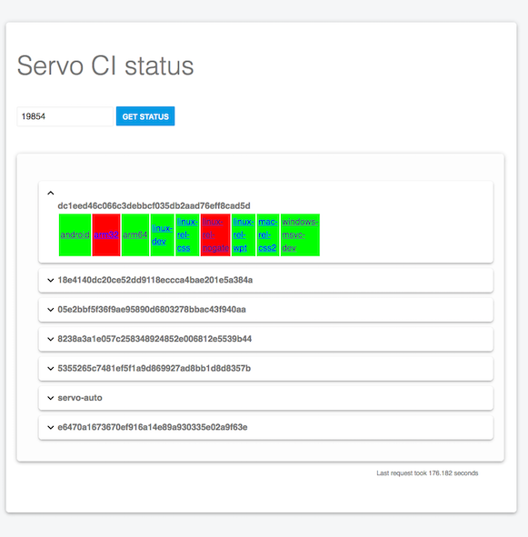

Tool to show the build status of a Servo PR.



## Running the tool
Before running the tool make sure that you have all its dependencies installed:
```bash
npm install -g gulp && npm install
```

You can serve this tool from http://localhost:3000 just by running this command:
```bash
gulp
```

You can develop this tool from http://localhost:3000 just by running this command:
```bash
gulp dev
```
